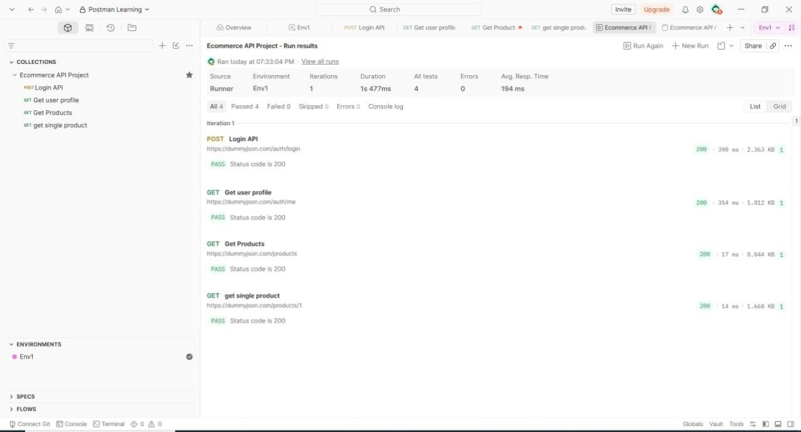

# Postman Ecom Api Testing

This is a project I made to practice API testing using Postman. I used a free fake ecommerce API called DummyJSON to test different endpoints like login, user profile, and products.

---

## About the Project

I followed a tutorial and built this step by step. The main thing I learned here is how to automatically extract a JWT token after login and use it in the next requests — without manually copying and pasting it every time.

---

## Base URL

https://dummyjson.com
---

## Requests I Tested

1. Login API — POST /auth/login  
Sends username and password, gets back a JWT token. I wrote a script to save that token automatically in the environment.

2. Get User Profile — GET /auth/me  
Uses the saved token to fetch the logged-in user's details.

3. Get Products — GET /products  
Fetches all products. Also saves the first product's ID for the next request.

4. Get Single Product — GET /products/1  
Fetches one product using the ID saved from the previous request.

---

## Test Results

All 4 requests passed with status 200.

| Request | Status | Test |
|---|---|---|
| Login API | 200 OK | ✅ Pass |
| Get User Profile | 200 OK | ✅ Pass |
| Get Products | 200 OK | ✅ Pass |
| Get Single Product | 200 OK | ✅ Pass |

Total: 4 passed, 0 failed, 0 errors

---

## Environment Variables

| Variable | Description |
|---|---|
| base_url | https://dummyjson.com |
| token | Auto-saved after login |
| productId | Auto-saved from products response |

---

## How to Use

1. Clone this repo
2. Open Postman
3. Import the collection file
4. Import the environment file
5. Select Env1 as active environment
6. Run Login API first — token saves automatically
7. Then run the rest or use Collection Runner

---

## Tools Used

- Postman
- DummyJSON API
- JavaScript (for scripts)
- GitHub

---

## What I Learned

- How to use environment variables in Postman
- How to write post-response scripts to extract and save tokens
- How to chain requests so they pass data to each other
- How to write basic test assertions using pm.test()
- How to use Collection Runner to run all requests at once

---

Made by Purva Rawale  
